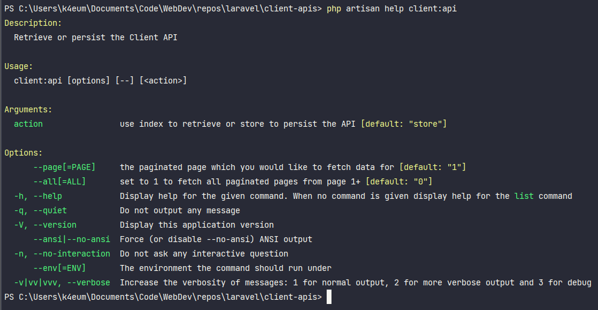

## Backend multiple API consumption

### Summary

Integrating with 3rd party API's to pull in user data. 
This project uses the https://reqres.in/ API.

Build a console command that pulls data from an API and stores it 
against the User model. This command should not have any user 
interaction at all but should have a way to call the next page in 
the pagination on the API, so if there are 12 total pages then this 
command should be developed in a way to call these other pages so we 
can potentially retrieve all the data from the API.

Key focus:  
To be maintainable and flexible to add other API calls in the future. 

Main tasks:
- Retrieve a fresh set of the data from the API's - to be used anywhere else in the application
- Retrieve user data and store against the User Model

### Solution

My solution uses the database to store API end points to a Client
model, uses an associated class to call the API end points and 
performs any data normalisation. The Users model also includes a client_id column to associate it with its source of origin.

### Installation and run
- php artisan migrate
- php artisan db:seed
- php artisan client:api

### Other factors to consider
#### 1. What testing can we perform using PHPUnit
- Given we have a client model = Reqres
- Run the artisan command = client:api
- Check client class Reqres exists - must throw an exception if not found and gracefully exit
- Fake the api with a custom closure based response
- Use the response returned to assert a json structure is matched
- Use an assertion to check the database if a record has/contains the above json structure
- Use an assertion to check the artisan command's exit code = 0 for success

#### 2. How would we respond if the API we are calling goes down
- We would need to record/log which client class API failed to make its call
- At this point maybe use a sms service or email/notify an administrator to switch the status of the API to in-active 
- Or automatically switch the API status off upon failure and then notify the administrator

#### 3. How would we use the command in a schedule to repeatedly update the users from the API
- The command uses the Laravel 7 upsert. This takes an array of arrays (in this case our response data) to insert, identifies if the record already exists and if so an array of what should be updated
- The solution stores a client_id column on the users table to link it to the API's users ID

### Further solutions I've considered
- Depending on the amount of records we have in the Client model we may want to use chunking
- Many API's would have stored their first name and last name in separate columns and so should we 
- Add a status column on the Client model so we can activate and de-activate any API's 
- Add a schedule time column on the Client model as we may only want to call the API's at a specific time
- Create own exception classes to target more specific error handling per Client
- Move the logic for retrieving and storing the api data into a trait and away from model 
- Add a history model to log API calls, when was it called, how many records were retrieved, new and updated
- We could examine model attribute using the isDirty and getChanges to create a log of changes, although this could accumulate to too many additional database queries potentially slowing our process down

### Features
- Uses the HTTP Client introduced in Laravel 7 instead of using Guzzle directly
- Uses the new Eloquent upsert method introduced in Laravel 8 accommodating updating existing or creating new models

### Screenshots

- The Client model, at this point only has one API end point

- The Artisan command help for our command (client:api). By default, always starts at page 1 and always persists the data 

- An example of data retrieved and stored against the User model from the 2nd page of the pagination https://reqres.in/api/users?page=2

- An example retrieving all data (page 1 & 2) after retrieving page 2 first. This would have updated the users from page 2 but inserted those from page 1

